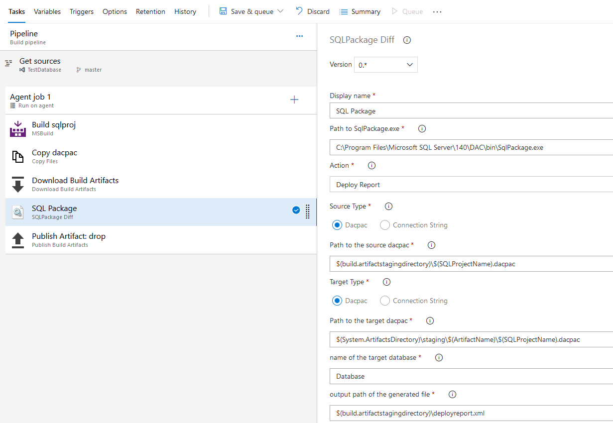
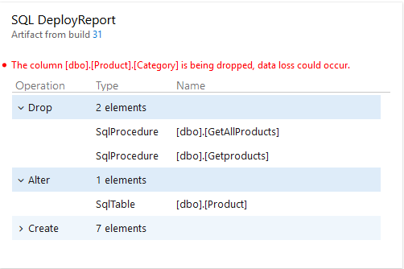
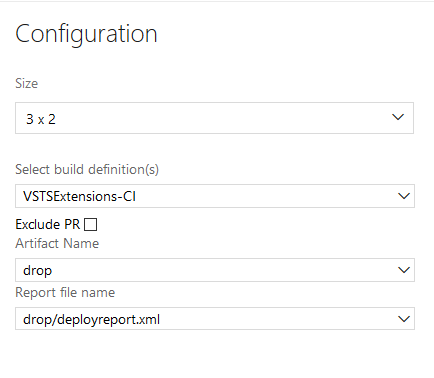

# SQLPackage Compare

This extension includes the build task SQLPackageDiff and the dashboard widget DeployReport Widget. 

## Build Task SQLPackageDiff

This task uses the tool [sqlpackage.exe](https://docs.microsoft.com/en-us/sql/tools/sqlpackage?view=sql-server-2017) to compare two databases and generate an update script or a deploy report.
Source and target databases can be dacpacs or connexion strings to SQL Server databases.

I use this task this way :
After the build an SQL project, I download the artifact of another branch to get the dacpac of the SQL project from that branch. And I use the task SQLPackageDiff to compare the dacpacs of the two branches.

## DeployReport Widget
This dashboard widget gets a deploy report generated by sqlpackage from the artifact of a build and displays it. The artifact comes from the last successful build of a selected pipeline. 

### Configuration

To configure this widget you need to select a build pipeline, select an artifact from that build, and select the deployreport file from that artifact.

If the Exclude PR checkbox is checked, the widget will not show deploy reports from builds triggered by pull requests. 

